**SENG 438 - Software Testing, Reliability, and Quality**

**Lab. Report #3 – Code Coverage, Adequacy Criteria and Test Case Correlation**

| Group \#:      |   30  |
| -------------- | --- |
| Student Names: |  Agam Aulakh   |
|                |  Melanie Nguyen   |
|                |  Jeff Rozsell   |
|                |  Heidi Schaefer   |

(Note that some labs require individual reports while others require one report
for each group. Please see each lab document for details.)

# 1 Introduction

In this lab we were tasked with computing the testing coverage of our previous test suite on both the Range and DataUtilities modules of JFreeChart. In doing so we would make a benchmark and compare against the acceptable standards set our before the assignment. The following are the standards we wish to achieve in this lab:

Three coverage metrics
Statement - 90%
Branch - 70%
Condition (if tool doesn’t support, you can change metric e.g. you might decide to replace condition coverage with method coverage, if you are using EclEmma) - 60%

# 2 Manual data-flow coverage calculations for X and Y methods

### CFG of shift()
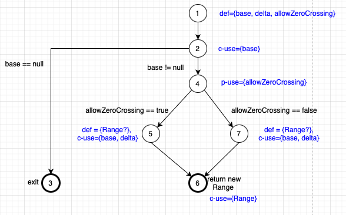
### CFG of calculateColumnTotal()

### DFG of shift()
### DFG of calculateColumnTotal()

# 3 A detailed description of the testing strategy for the new unit test

Testing Plan
We will be choosing to study the calculateColumnTotal() from DataUtilities and shift() from Range.

We will first assess the coverage statistics for our current test suite in the metrics of statement, branch, and condition.
In order to fully grasp how the coverage works we will recompute the coverage manually by hand.

This will involve constructing a CFG and the corresponding DFG in order to seek out paths/pairs which we are not covering. These omissions will then be worked into our new test suite.

Furthermore, we will again retest the metrics after the introduction of the new test cases in order to evaluate the changed coverage of our test suite.

We will then provide a brief analysis and lessons learned from this assignment.

# 4 A high level description of five selected test cases you have designed using coverage information, and how they have increased code coverage

Only four additional tests were necessary to achieve 100% coverage:

**scaleNegPosNeg()** - Scaling by a negative factor was previously neglected in our initial test suite, as it was indicated in the JavaDoc that the factor must be non-negative. Although the factor should be non-negative to produce a valid range, the error handling should still be tested to have full coverage. This test case improved both statement and branch coverage.

**calculateColumnTotalForNullObject()** - A null object was passed to the calculateColumnTotal function to trigger the parameter check for null objects. This was neglected in the original test suite as an error would be thrown, but as above, error handling should still be tested to ensure full coverage.

**calculateColumnTotalForNullElement()** - The only element of the object passed into calculateColumnTotal is null. As the loop which calculated column totals had an if statement ensuring the element was not null, the branch where a null value was present was taken instead of the previously taken branch, therefore branch coverage was improved.

**cloneNullElement()** - The only element of a 2D array passed into the clone method was null. As null is not a permitted value in the JavaDoc, this argument was neglected. As above, the error handling must be checked for full coverage. Branch coverage was improved through this method.

# 5 A detailed report of the coverage achieved of each class and method (a screen shot from the code cover results in green and red color would suffice)

## DataUtilitiesTest
We tested:
1. calculateColumnTotal()
2. calculateRowTotal()
3. clone()
4. createNumberArray()
5. createNumberArray2D()

#### pre-change
### Statement coverage
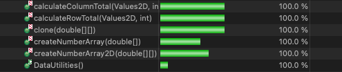
### Branch coverage
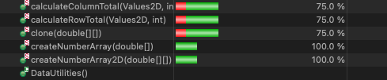
### Method coverage
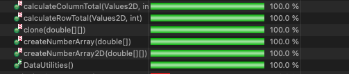

#### post-change
### Statement coverage
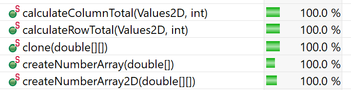
### Branch coverage
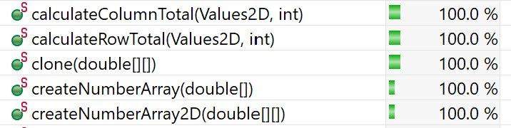
### Method coverage
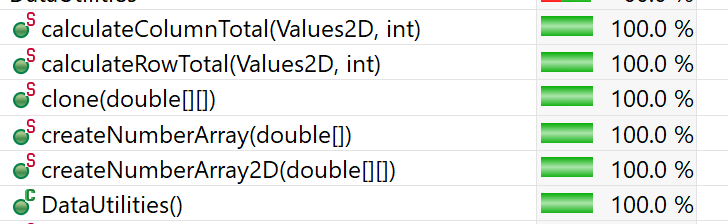

## RangeTest
We tested:
1. scale()
2. shift() 
3. getLength()
4. getUpperBound()
5. getLowerBound()

#### pre-change
### Statement coverage
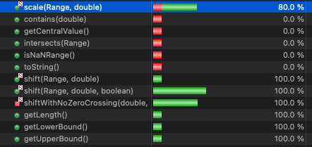
### Branch coverage
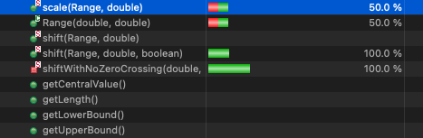
### Method coverage
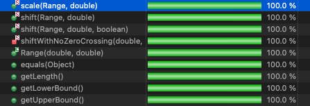

#### post-change
### Statement coverage
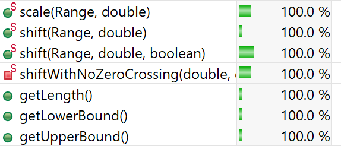
### Branch coverage
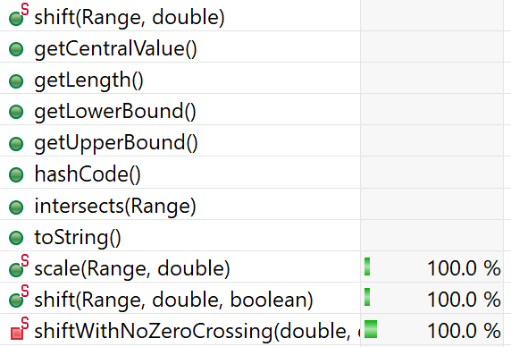
### Method coverage
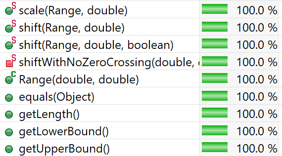

# 6 Pros and Cons of coverage tools used and Metrics you report

## Tools - EclEmma
### Pros
- Can catch test cases that were missed by human testers
- Considers cases that throw errors, which may have not been considered when making the test suite
### Cons
- Somewhat difficult to set up initially
- Could be misleading for larger programs, as coverage may appear to be 100% but could still have bugs

## Metrics
### Pros
### Cons

# 7 A comparison on the advantages and disadvantages of requirements-based test generation and coverage-based test generation.

Text…

# 8 A discussion on how the team work/effort was divided and managed

For this assignment the work was split up initially into two groupings. On covered each of the overarching modules. Within each section there was pair work done until each phase was completed. The group then met up and discussed their results for the section. If there was any glaring differences or issues then each section was discussed before moving onto the next portion.

The report was divided up into equal parts and assigned to be written and completed by all individuals. The lessons learned was done as a group at the end so that there could be a discussion between the group members.

There was overall two group meetings and two individual section meetings for this lab. Then there was a small amount of individual work done by each group member.

# 9 Any difficulties encountered, challenges overcome, and lessons learned from performing the lab

There were a couple portions which proved more challenging than others. In particular:

1. Understanding documentation well enough to search for branches/statements/methods
2. Finding and creating the missing tests in order to increase the coverage percentages for our test suite
3. Deciding what warranted nodes in our CFG
4. Manually following the DFG and def-use pairs/paths
5. Dealing with nullptr vs. null values in a multitude of our tests

However, after going through this assignment we have learned quite a bit about:

1. Evaluating different coverage metrics in order to have broader view of the resulting coverage statistics
2. Learned how to generate CFG and DFG for functions
3. Demonstrated just how time / effort consuming making the def-use calculations are
4. Demonstrated the usefulness of the automated testing tools when dealing with multiple coverage metrics

# 10 Comments/feedback on the lab itself

The lab was a good exercise in learning how to improve test cases using the appropriate statistics and DFG diagrams. It was easy enough to follow, while being challenging enough for us to learn a fair amount.
