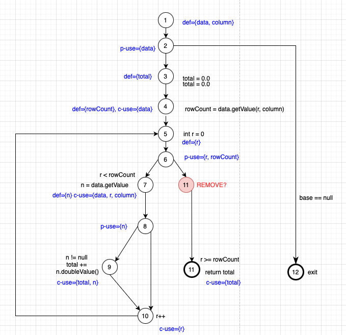

**SENG 438 - Software Testing, Reliability, and Quality**

**Lab. Report #3 – Code Coverage, Adequacy Criteria and Test Case Correlation**

| Group \#:      |   30  |
| -------------- | --- |
| Student Names: |  Agam Aulakh   |
|                |  Melanie Nguyen   |
|                |  Jeff Rozsell   |
|                |  Heidi Schaefer   |

(Note that some labs require individual reports while others require one report
for each group. Please see each lab document for details.)

# 1 Introduction

In this lab we were tasked with computing the testing coverage of our previous test suite on both the Range and DataUtilities modules of JFreeChart. In doing so we would make a benchmark and compare against the acceptable standards set our before the assignment. The following are the standards we wish to achieve in this lab:

Three coverage metrics
Statement - 90%
Branch - 70%
Condition (if tool doesn’t support, you can change metric e.g. you might decide to replace condition coverage with method coverage, if you are using EclEmma) - 60%

# 2 Manual data-flow coverage calculations for X and Y methods

### CFG of shift()

### CFG of calculateColumnTotal()

### DFG of shift()
### DFG of calculateColumnTotal()

# 3 A detailed description of the testing strategy for the new unit test

Testing Plan
We will be choosing to study the calculateColumnTotal() from DataUtilities and shift() from Range.

We will first assess the coverage statistics for our current test suite in the metrics of statement, branch, and condition.
In order to fully grasp how the coverage works we will recompute the coverage manually by hand.

This will involve constructing a CFG and the corresponding DFG in order to seek out paths/pairs which we are not covering. These omissions will then be worked into our new test suite.

Furthermore, we will again retest the metrics after the introduction of the new test cases in order to evaluate the changed coverage of our test suite.

We will then provide a brief analysis and lessons learned from this assignment.

# 4 A high level description of five selected test cases you have designed using coverage information, and how they have increased code coverage

Text…

# 5 A detailed report of the coverage achieved of each class and method (a screen shot from the code cover results in green and red color would suffice)

## DataUtilitiesTest
We tested:
1. scale()
2. shift() 
3. getLength()
4. getUpperBound()
5. getLowerBound()

#### pre-change
### Statement coverage

### Branch coverage

### Method coverage

#### post-change
### Statement coverage

### Branch coverage

### Method coverage

## RangeTest
We tested:
1. calculateColumnTotal()
2. calculateRowTotal()
3. clone()
4. createNumberArray()
5. createNumberArray2D()

#### pre-change
### Statement coverage

### Branch coverage

### Method coverage

#### post-change
### Statement coverage

### Branch coverage

### Method coverage

# 6 Pros and Cons of coverage tools used and Metrics you report

## Pros
## Cons

# 7 A comparison on the advantages and disadvantages of requirements-based test generation and coverage-based test generation.

Text…

# 8 A discussion on how the team work/effort was divided and managed

For this assignment the work was split up initially into two groupings. On covered each of the overarching modules. Within each section there was pair work done until each phase was completed. The group then met up and discussed their results for the section. If there was any glaring differences or issues then each section was discussed before moving onto the next portion.

The report was divided up into equal parts and assigned to be written and completed by all individuals. The lessons learned was done as a group at the end so that there could be a discussion between the group members.

There was overall two group meetings and two individual section meetings for this lab. Then there was a small amount of individual work done by each group member.

# 9 Any difficulties encountered, challenges overcome, and lessons learned from performing the lab

Text…

# 10 Comments/feedback on the lab itself

The lab was a good exercise in learning how to improve test cases using the appropriate statistics and DFG diagrams. It was easy enough to follow, while being challenging enough for us to learn a fair amount.
